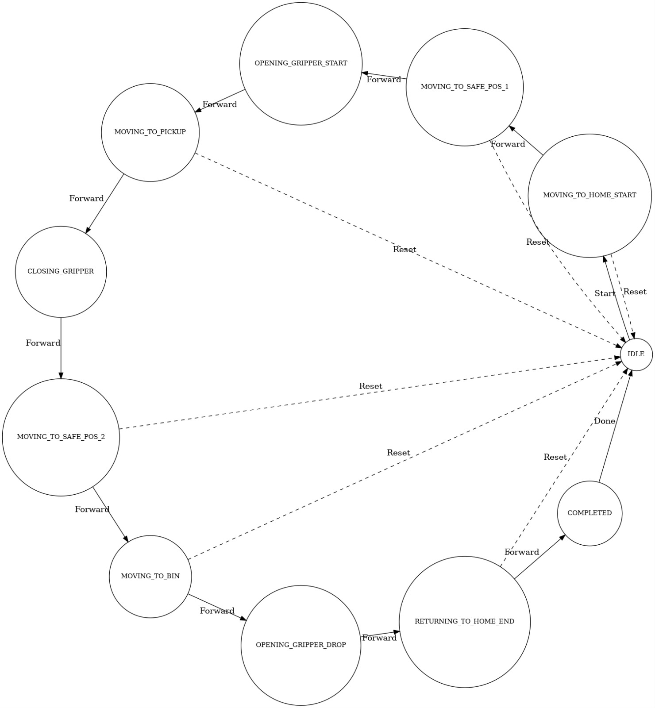

# Proyecto final de robótica

## 1. Integrantes

- Sergio Andrés Bolaños Penagos
- Sergio Felipe Rodriguez Mayorga
- Johan Camilo Patiño Mogollón
- Jorge Nicolas Garzón Acevedo

## 2. Introducción y objetivos

Este proyecto implementa un sistema de clasificación automática de objetos usando el robot **Phantom X Pincher** con **ROS 2**, **MoveIt 2** y un pipeline de **visión por computador** basado en **YOLO**. El robot toma objetos ubicados en una **zona de recolección** y los deposita en la **caneca correspondiente** según su tipo.

Las figuras consideradas son:

- **Cubo**: Caneca **roja**
- **Cilindro**: Caneca **verde**
- **Pentágono**: Caneca **azul**
- **Rectángulo**: Caneca **amarilla**

El sistema está compuesto por:

- Un sistema de control con **MoveIt 2** que se encarga de planear y realizar los movimientos tanto del brazo como de la pinza del robot, decidiendo cómo llegar de un punto a otro de forma segura y eficiente.
- Un **nodo de alto nivel** que recibe una **pose objetivo** en el tópico `/pose_command` y ejecuta la trayectoria correspondiente.
- Un **pipeline de visión** basado en YOLO que detecta la figura presente en la zona de recolección usando una cámara **ORBBEC Astra Pro**.

**Objetivos principales del proyecto:**

1. Implementar una rutina completa de pick & place para las 4 figuras usando `/pose_command`.
2. Integrar MoveIt 2 con el modelo URDF/Xacro del Phantom X Pincher, incluyendo el entorno de trabajo (base, canecas, mástil y canastilla).
3. Entrenar un modelo de YOLO con imágenes reales capturadas desde la cámara y usarlo para detectar las figuras en tiempo real.
4. Integrar la salida de visión con el nodo de movimiento, logrando una clasificación autónoma de objetos en el robot real.

## 3. Instalación

Esta sección resume los pasos principales para instalar dependencias y compilar el workspace. Para detalles completos ver `guias/Setup/readme.md`.

### 3.1 Dependencias generales

- **Sistema operativo recomendado:** Ubuntu 22.04 / 24.04.
- **ROS 2:** Humble o Jazzy (instalación desktop completa).
- **Git LFS:** necesario para manejar modelos 3D, videos y archivos pesados.

Instalar Git LFS:

```bash
sudo apt update
sudo apt install git-lfs
git lfs install
```

Instalar los paquetes principales de ROS 2 usados en el proyecto (MoveIt, integración con Gazebo, etc.):

```bash
sudo apt-get install ros-humble-ros2-control
sudo apt-get install ros-humble-ros2-controllers
sudo apt-get install ros-humble-xacro
sudo apt-get install ros-humble-ros-gz-*
sudo apt-get install ros-humble-*-ros2-control
sudo apt-get install ros-humble-joint-state-publisher-gui
sudo apt-get install ros-humble-tf-transformations
sudo apt-get install ros-humble-moveit*
```

> Importante: Adaptar el nombre de la distribución (`jazzy`/`humble`) según el sistema usado.

Por otra parte instalar los siguientes paquetes
```bash
sudo apt-get install python3-pip
pip install transforms3d
pip install flask
pip install pyserial
pip install flask-ask-sdk
pip install ask-sdk
sudo apt install python3-lark
pip install lark
```

Configurar ROS 2 para que siempre quede activo en cada terminal (ejemplo para Humble):

```bash
cd
sudo gedit .bashrc
# Al final del archivo añadir
source /opt/ros/humble/setup.bash
```

### 3.2 Clonado del repositorio

```bash
git clone https://github.com/sergiosinlimites/robotica-proyecto-final
cd robotica-proyecto-final/KIT_Phantom_X_Pincher_ROS2/phantom_ws
```

Asegurarse de que Git LFS está activo para los archivos pesados (STL, videos, etc.). En caso de estarlo deben aparecer dentro de `phantom_ws/src/phantomx_pincher_description/meshes`

### 3.3 Compilación del workspace

El workspace principal se encuentra en `phantom_ws/`.

```bash
cd phantom_ws
./build.sh
source install/setup.bash
```

El script `build.sh` fuerza el uso de `/usr/bin/python3` y configura `colcon` para evitar conflictos con entornos de Python externos.

### 3.4 Ejecución básica (robot real + visión + clasificador)

1. **Stack de movimiento (robot real)**

```bash
cd phantom_ws
source /opt/ros/humble/setup.bash   # o jazzy
source install/setup.bash

ros2 launch phantomx_pincher_bringup phantomx_pincher.launch.py \
  use_real_robot:=true \
  start_clasificador:=true
```

2. **Visión (cámara + YOLO)**

```bash
cd phantom_ws
source /opt/ros/humble/setup.bash   # o jazzy
source install/setup.bash

export PINCHER_YOLO_MODEL=$PWD/runs/classify/yolo_shapes_long/weights/best.pt

ros2 launch phantomx_pincher_bringup vision_bringup.launch.py \
  start_camera:=true \
  camera_device:=/dev/video2 \
  start_clasificador:=false
```

Con esta configuración:

- MoveIt 2 y el nodo `commander` controlan el brazo real a través del controlador `follow_joint_trajectory`.
- `yolo_recognition_node` detecta las figuras en el ROI de la cámara.
- `clasificador_node` escucha el tipo de figura detectada y ejecuta la rutina completa de pick & place.


## 4. Calibración manual de las poses

Para definir las poses utilizadas en la rutina (zona de recolección y canecas), se siguió el flujo de la guía de MoveIt:

1. **Lanzar el robot con MoveIt y RViz**
   
   ```bash
   cd phantom_ws
   source install/setup.bash
   ros2 launch phantomx_pincher_bringup phantomx_pincher.launch.py
   ```

   En RViz se selecciona se mueven las articulaciones una por una hasta una pose adecuada (por ejemplo, sobre la zona de recolección o encima de una caneca).

2. **Leer la pose del efector final con `tf2_echo`**

   En otro terminal:

   ```bash
   source install/setup.bash
   ros2 run tf2_ros tf2_echo phantomx_pincher_base_link phantomx_pincher_end_effector
   ```

   Con este comando se obtienen en tiempo real:

   - La **traslación** \(x, y, z\) del efector final.
   - La **orientación** en cuaterniones (que luego se convierte a \(roll, pitch, yaw\) si es necesario), y estos valores junto con la traslación se guardan para cada pose.

3. **Registrar poses clave**

   Para cada posición importante de la rutina se anotaron los valores devueltos por `tf2_echo`, por ejemplo:
   - Pose de **home**.
   - Pose de **aproximación**
   - Pose de **recolección**.
   - Pose sobre la **caneca roja**.
   - Pose sobre la **caneca verde**.
   - Pose sobre la **caneca azul**.
   - Pose sobre la **caneca amarilla**.

   Los valores de estas poses se pueden ver en `phantom_ws/src/phantomx_pincher_bringup/config/poses.yaml`

4. **Verificación usando `/pose_command`**

   Después de guardar una pose, se cerró RViz, se relanzó el bringup y se verificó cada pose enviando un mensaje al tópico `/pose_command` desde la terminal, por ejemplo:

   ```bash
   ros2 topic pub -1 /pose_command phantomx_pincher_interfaces/msg/PoseCommand \
   "{x: 0.128, y: 0.0, z: 0.100, roll: 3.142, pitch: 0.0, yaw: 0.0, cartesian_path: false}"
   ```

   De esta manera se ajustaron manualmente las poses hasta obtener movimientos suaves y seguros en el espacio de trabajo real.
   >Es importante en esta parte mencionar que en ocasiones MoveIt no logra ir a la pose seleccionada, para esto se puede quitar el parámetro **-1** que manda un solo intento y en su lugar, al quitarlo, manda constantemente y al hacerlo, en alguno de los intentos logrará hallar la IK para la trayectoria para ir a la pose. Esto es un problema que se presenta en ROS Humble y que ya fue solucionado para ROS Jazzy.

## 5. Nodos de movimiento basados en `/pose_command` y MoveIt

La comunicación de alto nivel para el movimiento del brazo se realiza mediante el tópico:

```bash
/pose_command
```

con mensajes del tipo:

```text
phantomx_pincher_interfaces/msg/PoseCommand
```

### 5.1 Pruebas iniciales desde la terminal

Antes de crear nodos específicos, se probaron las poses directamente desde la consola:

```bash
ros2 topic pub -1 /pose_command phantomx_pincher_interfaces/msg/PoseCommand \
"{x: X_OBJ, y: Y_OBJ, z: Z_OBJ, roll: R_OBJ, pitch: P_OBJ, yaw: Y_OBJ, cartesian_path: false}"
```

Usando las poses calibradas con `tf2_echo`, esto permitió verificar la cinemática inversa y el correcto movimiento para cada pose.

### 5.2 Nodos creados para el movimiento

El sistema de movimiento del robot está organizado en varios paquetes ROS 2, cada uno con una función específica dentro del flujo de control y planeación de trayectorias:

- **`phantomx_pincher_bringup`**: Es el encargado de lanzar el sistema completo. Aquí se incluye el lanzamiento de MoveIt 2, los nodos auxiliares y los controladores necesarios. Los controladores que se utilizan en este contexto son:
  - **`joint_state_broadcaster`**: Publica el estado actual (ángulos, velocidades) de cada articulación.
  - **`joint_trajectory_controller`**: Recibe trayectorias calculadas por MoveIt y se encarga de enviar los comandos de posición/velocidad a los motores del robot, ya sea en simulación o en hardware real.
  - Este paquete también inicia el nodo `commander`, que es el responsable de coordinar la ejecución de movimientos de alto nivel.

- **`phantomx_pincher_moveit_config`**: Contiene la configuración detallada de MoveIt, que incluye:
  - Archivos SRDF con la descripción semántica del robot (grupos de articulaciones, cadenas cinemáticas).
  - Configuración de los planificadores y algoritmos de movimiento (como OMPL).
  - Parámetros para los controladores y límites articulares.
  Este paquete permite que MoveIt pueda planificar trayectorias seguras para el brazo.

- **`phantomx_pincher_description`**: Incluye el modelo del robot en formato URDF/Xacro, así como la descripción del entorno (base, canecas de colores, mástil, canastilla, etc.). Este modelo es esencial tanto para la simulación, la visualización en RViz, como para el cálculo de trayectorias y colisiones en MoveIt.

- **`pincher_control`**: Este paquete implementa la lógica de control de más alto nivel. Aquí se desarrolla el nodo que se suscribe al tópico `/pose_command`, interpreta el mensaje de pose deseada y ordena a MoveIt que planifique y ejecute el movimiento correspondiente.
  - En función de la secuencia que se desee (por ejemplo: ir a la pose de recolección, trasladar el objeto a una caneca, volver a home), este nodo publica sucesivamente comandos a MoveIt y verifica la ejecución correcta.

De esta forma, el conjunto de paquetes y controladores permite que el usuario o una aplicación externa le indique, mediante `/pose_command`, una posición y orientación deseada para el efector final del robot, y el sistema se encargue automáticamente de resolver la cinemática, planificar la trayectoria y ejecutar el movimiento físico de forma segura, tanto en simulación como sobre el hardware real.


- `phantomx_pincher_bringup`: lanza MoveIt 2, los controladores y el nodo `commander`.
- `phantomx_pincher_moveit_config`: contiene la configuración de MoveIt (SRDF, planning groups, controladores, límites, etc.).
- `phantomx_pincher_description`: define el URDF/Xacro del robot y del entorno (base, canecas, mástil, canastilla).
- `pincher_control`: contiene nodos de más alto nivel, entre ellos el nodo que escucha `/pose_command` y ejecuta la secuencia de movimiento.

El nodo de movimiento (en `pincher_control`) se encarga de:

1. **Suscribirse** al tópico `/pose_command`.
2. Convertir el mensaje `PoseCommand` en una **pose objetivo** para el grupo de planificación del brazo.
3. Usar la API de **MoveIt 2** para:
   - Resolver la **cinemática inversa** (IK) de la pose objetivo.
   - Planear una trayectoria en el espacio de juntas.
4. Enviar la trayectoria resultante al controlador `follow_joint_trajectory` para su ejecución.

### 5.3 ¿Cómo planea MoveIt 2 las trayectorias?

De forma resumida:

- El nodo de movimiento fija una **pose objetivo** para el efector final (posición y orientación).
- MoveIt utiliza un plugin de **cinemática inversa** para convertir esa pose en una configuración de articulaciones válida.
- A partir de la posición actual y de la posición objetivo, MoveIt llama a un planificador (por ejemplo, de OMPL) que genera una **trayectoria continua** en el espacio de juntas respetando límites de velocidad, aceleración y colisiones.
- La trayectoria generada se envía al controlador `follow_joint_trajectory`, que interpola las referencias y mueve físicamente el brazo.

En la rutina final, el nodo de alto nivel concatena varias poses (recolección, tránsito, sobre caneca, depósito, regreso a reposo) publicando secuencialmente mensajes en `/pose_command`.

## 6. Visión por computador y YOLO

La parte de visión se basa en una cámara **ORBBEC Astra Pro** apuntando a la zona de recolección. Con ella se construyó un dataset y se entrenó un modelo de **YOLO** para clasificación de figuras.

### 6.1 Adquisición y preparación del dataset

- Se capturaron imágenes reales en el laboratorio colocando las figuras (cubo, cilindro, pentágono, rectángulo y fondo vacío) dentro del **ROI** definido por la canastilla.
- Se tomaron muestras con diferentes posiciones y ligeras variaciones de iluminación para mejorar la robustez del modelo.
- Las imágenes se organizaron en carpetas por clase dentro de `dataset_yolo/`.
- El dataset se dividió en subconjuntos de **entrenamiento** y **validación** en un 80/20.

### 6.2 Entrenamiento del modelo YOLO

El entrenamiento se realiza con el script `train_yolo.py` ubicado en el workspace:

- El script carga las imágenes de `dataset_yolo`.
- Se configura el modelo YOLO de clasificación con las 5 clases (cubo, cilindro, pentágono, rectángulo, vacío).
- Se entrena el modelo hasta converger en la métrica de validación.
- El mejor modelo se guarda en `runs/classify/.../weights/best.pt`.

Este modelo se referencia posteriormente con la variable de entorno:

```bash
export PINCHER_YOLO_MODEL=$PWD/runs/classify/yolo_shapes_long/weights/best.pt
```

### 6.3 Inferencia en línea e integración con el movimiento

Durante la ejecución:

1. El nodo `vision_bringup` inicializa la **cámara ORBBEC Astra Pro** y publica imágenes en un tópico de imagen.
2. `yolo_recognition_node` recibe las imágenes, recorta el **ROI** (zona de recolección) y ejecuta inferencia con el modelo YOLO entrenado.
3. El nodo de visión publica el **tipo de figura detectada** en un tópico de alto nivel (por ejemplo, `/figure_type`).
4. El nodo `clasificador_node` escucha este tópico y, según la figura detectada, decide qué secuencia de poses enviar por `/pose_command`:
   - Si la figura es **cubo** → secuencia hacia la **caneca roja**.
   - Si es **cilindro** → secuencia hacia la **caneca verde**.
   - Si es **pentágono** → secuencia hacia la **caneca azul**.
   - Si es **rectángulo** → secuencia hacia la **caneca amarilla**.

De esta forma, la visión y el movimiento quedan integrados en una rutina completamente autónoma de clasificación de objetos.


## 7. Estructura de carpetas y paquetes principales

A nivel de repositorio:

- `phantom_ws/` — Workspace de ROS 2 que contiene todos los paquetes del proyecto.
- `guias/` — Documentación adicional (MoveIt, Setup, Proyecto, etc.).
- `matlab/` — Scripts auxiliares en MATLAB relacionados con el laboratorio.
- `docs_lab5/` — Documentos de contexto del laboratorio.

Dentro de `phantom_ws/src/` los paquetes principales son:

- `phantomx_pincher_description` — URDF/Xacro del robot y del entorno (base, canecas, mástil de cámara, canastilla, etc.).
- `phantomx_pincher_moveit_config` — Configuración de MoveIt 2 (SRDF, grupos de planificación, controladores, parámetros de planificación y RViz).
- `phantomx_pincher_bringup` — Archivos `launch` para levantar el robot en simulación o con robot real (`phantomx_pincher.launch.py`, `vision_bringup.launch.py`).
- `pincher_control` — Nodos de control de alto nivel, integración con Dynamixel, nodos de visión y nodos de rutina de clasificación.
- Scripts de entrenamiento de YOLO (como `train_yolo.py`) y carpetas de dataset (`dataset_yolo/`) y resultados (`runs/`).

Esta organización permite separar claramente:

- La **descripción del robot**.
- La **configuración de MoveIt**.
- El **bringup** (cómo se lanza todo el sistema).
- Los **nodos de control y de visión**.


## 8. Vision general del sistema basado en una maquina de estados finita (FSM) implementada en software
Basado en los nodos implementados y siguiendo la arquitectura de ROS2 , se propone integrar una logica de ejecucion global del sistema basado en una FSM, esto permite estructurar de  una mejor manera las rutinas del robot minimizando bugs que puedan surgir de fallos en la comunicacion/interaccion de los nodos de ROS. El diagrama de transicion de estados de la FSM propuesta se ve a continuacion: 

 <p align="center">
  
</p>

Esta maquina de estados se podria implementar dentro del paquete pincher control creando un nuevo nodo para ello, permitiendo asi que este nodo con la FSM interactue con los nodos de vision, y control para poder manejar el robot siguiendo una logica de estados propuestas, la cual basaria sus variables de transicion en las variabes otorgadas por el nodo de vision y de control, y actuaria directamente sobre este ultimo para ejecutar la rutina deseada. 

Esto ayudaria a insensibilizar la ejecuacion de la rutina ante datos basura que pueda estar enviando el modulo de vision, ademas de optimizar los recursos de Hardware del sistema al poder inactivar el modulo de vision mientras se esta ejecutando la rutina del robot.  


## 9. Resultados

En esta sección se documentarán los resultados obtenidos con el sistema en simulación y con el robot real.

- **Simulación:** funcionamiento completo de la rutina de clasificación en el entorno simulado, mostrando el movimiento del brazo entre zona de recolección y canecas.
- **Robot real:** ejecución de la rutina con la cámara ORBBEC Astra Pro, detección de figuras por YOLO e interacción física con las piezas.

Matríz de confusión del modelo YOLO implementado
<p align="center">
  
</p>

**Enlaces a videos (YouTube):**

- Video de implementación: _[enlace por agregar]_

> Nota: según la rúbrica, los videos deben iniciar con la introducción de Labsir.


## 10. Conclusiones

En este proyecto se integraron **cinemática, planificación de movimiento y visión por computador** en un mismo sistema robótico, logrando una rutina de clasificación autónoma sobre el robot Phantom X Pincher. La calibración manual de poses con MoveIt y `tf2_echo` permitió obtener posiciones seguras y reproducibles para la zona de recolección y las canecas, sirviendo como base para el diseño de las trayectorias.

El entrenamiento de un modelo YOLO con imágenes reales de la cámara ORBBEC Astra Pro demostró la importancia de contar con un dataset bien curado y balanceado para obtener buenas tasas de acierto en la detección. Finalmente, la integración entre los nodos de visión y los nodos de movimiento a través de ROS 2 validó el uso de esta plataforma para desarrollar sistemas robóticos modulares y escalables.

> El grupo puede complementar esta sección con métricas cuantitativas (tiempos de ejecución, tasas de acierto, fallos observados) y reflexiones personales sobre el trabajo realizado.
